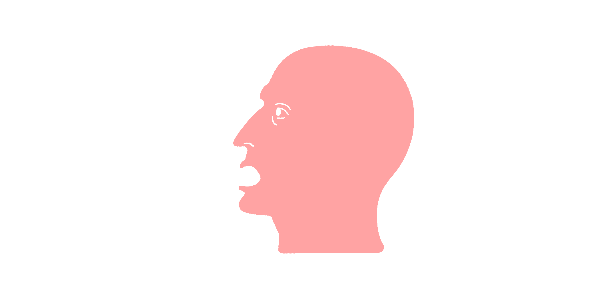

# CHANTER

a python speech synthesizer channeling the spirit of IRCAM's CHANT system—FOF (fonction d'onde formantique) grains shaped by coarticulation, phrase dynamics, and the ancient architecture of sung speech.

## what it does

transforms text into wavering, vowel-rich audio via:

- **FOF grain synthesis** — each glottal pulse spawns decaying sinusoids at formant frequencies
- **coarticulation engine** — phonemes influence neighbors, smoothing transitions like actual vocal tracts
- **FORMES-style scheduling** — phrase contours, stress patterns, final lengthening emerge from rule systems
- **register modeling** — formant tuning shifts with pitch, simulating soprano/alto/tenor/bass resonance
- **jitter & shimmer** — multi-rate random wandering keeps it organic

## Architecture

```

Text
↓
NLPParser
↓
FORMES (phrase + phoneme rules)
↓
Sparsegram (time-indexed control frames)
↓
CHANTEngine
↓
.wav

````

## quick start

```bash
python CHANTER.py "hello world" -v tenor -o hello.wav
```

```bash
python CHANTER.py "what is the sound of one hand clapping?" -v alto --speed 0.5
```

## arguments

| flag | default | meaning |
|------|---------|---------|
| `-o/--out` | auto | output wav path |
| `-f/--pitch` | voice-dependent | base f0 in hz |
| `-s/--speed` | 0.38 | phoneme duration scale |
| `-v/--voice` | tenor | soprano/alto/tenor/bass |
| `-t/--tempo` | 1.0 | global tempo multiplier |
| `-d/--dynamics` | 0.7 | effort/loudness 0-1 |
| `--lookahead` | 8 | coarticulation window |
| `--phonemes` | built-in | custom yaml/json phoneme table |
| `--text-file` | — | read input from file |

## dependencies

```
numpy scipy pyyaml(optional)
```

## phoneme customization

drop a `phonemes.yaml` alongside the script or pass `--phonemes path/to/custom.yaml`:

```yaml
AA:
  phoneme_type: vowel
  formants: [[700, 130, 0], [1220, 70, -6], [2600, 160, -24]]
  voicing: 1.0
  glottal_tension: 0.5
```

each formant tuple: `[center_freq_hz, bandwidth_hz, amplitude_db]`

## how it works

1. **NLPParser** splits text on punctuation into breath groups, maps letters→phonemes via digraph+simple lookup
2. **FORMES scheduler** applies phrase dynamics, stress accents, legato rules
3. **CoarticulationEngine** blends formant targets across phoneme boundaries  
4. **RegisterModel** shifts formants based on f0 and voice type
5. **CHANTEngine** renders: for each glottal period, spawns FOF grains per formant, applies antiformants, mixes noise for fricatives/plosives
6. overlap-add with jitter/vibrato modulation

## lineage

inspired by xavier rodet's CHANT (1984) and the FORMES composition environment—where synthesis parameters became musical gestures and vocal models sang ircam's electroacoustic dreams.

[What is Chant?](https://ccrma.stanford.edu/~marek/chant_1.html)

[The CHANT Project: From the Synthesis of the Singing Voice to Synthesis in General](https://www.ee.columbia.edu/~dpwe/papers/RodetPB84-CHANT.pdf)

## license

do what thou wilt
